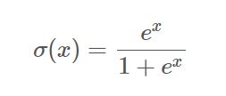

# CUDA Neural Network Implementation
## 1. CUDA Programming Model
Most Important Concept in CUDA is `kernel`. `Kernel` is a function that is executed in parallel by `N` different CUDA `threads`. When `kernel` is called we have to specify how many `threads` should execute our function. We distinguish between `device code` and `host code`.

`Device Code` is excuted on `GPU` and `host code` is executed on `CPU`. Example:
```C++
__global__ void addVectors(float* vec1, float* vec2, float* result) {
    int index = threadIdx.x;
    result[index] = vec1[index] + vec2[index];
}

int main() {
    ... // Rest of the Code
    addVectors<<<1, N>>>(vec1, vec2, result);
    ...
}
```

As you can see, kernel is defined with `__global__` keyword which means that this function runs on the `device` and is called from the `host code`. We can call this function with `addVectors<<<blocks_number, threads_in_block>>>(...)`, so in the example above we run `1` block of `N` CUDA `threads`. Inside our kernel function we can obtain index of current thread with `threadIdx.x`. 

In this case our `thread` block have just one dimension of `N` threads, but we can also execute multidimensional thread blocks. For instance, if we need to operate on matrices it would be much more convenient to run block of `N x M` threads and then obtain matrix row and column with `col = threadIdx.x; row = threadIdx.y`.

### Thread Hiearchy
In a single block we can have up to `1024` threads. So, we need more blocks in order to execute much more `threads`. Just as we can have `multidimensional thread blocks`, we can also have multidimensional grid of blocks as well. 

For convinence we can use `dim3` type to define either `grid of blocks` or `block of threads`. Add this to the `kernel` invocation to have `25 x 25` grid of blocks, and each of them have `32 x 32` threads.

```c++
...
dim3 num_of_blocks(25, 25);
dim3 threads_per_block(32, 32);
addVectors<<<num_of_blocks, threads_per_block>>>(vec1, vec2, result);
...
``` 

Visualization of `grid of blocks` and `block of threads`


### Memory Hiearchy 
As we know, `CPU` has `RAM` memory and so `GPU` also has its seperate `RAM`. They have different address spaces and so `CPU` cannot easily access data that reside in `GPU` memory so we need to manage transfer data from `CPU` memory to `GPU` memory. 

We need to allocate `host` memory and `device` memory seperately. For that this is what is done: 
```c++
...
float* vec1_host = new float[25 * 32];
float* vec2_host = new float[25 * 32];
float* result_host = new float[25 * 32];


cudaMalloc(&vec1_device, 25 * 32 * sizeof(float));
cudaMalloc(&vec2_device, 25 * 32 * sizeof(float));
cudaMalloc(&result_device, 25 * 32 * sizeof(float));

...
// here goes some vec1 and vec2 initialization
...

cudaMemcpy(vec1_device, vec1_host, 25 * 32 * sizeof(float), cudaMemcpyHostToDevice);
cudaMemcpy(vec2_device, vec1_host, 25 * 32 * sizeof(float), cudaMemcpyHostToDevice);

dim3 num_of_blocks(25);
dim3 threads_per_block(32);
addVectors<<<num_of_blocks, threads_per_block>>>(vec1_device, vec2_device, result_device);

cudaMemcpy(vec1_host, vec1_device, 25 * 32 * sizeof(float), cudaMemcpyDeviceToHost);

cudaFree(vec1_device);
cudaFree(vec2_device);
cudaFree(result_device);

...
```

`cudaMalloc(...)` allows us to allocate memory on `device` and `cudaMemcpy(...)` is used for `data transfer` between `host` and `device`. And that's it, our two vectors can now be correctly added and we can access this operation result in the `host code`. 

The memory we are using here is called `global memory`. It has the biggest capacity (several GB) and all `CUDA threads` have access to it, but it is also the slowest one. If you want your `CUDA kernels` to be fast, memory access performance is what you should really care about. 

Each `thread block` has shared memory visible only for its `threads`. It is much faster than global memory, but it has also much lower capacity (several dozen of kB). Every `single thread` is also equipped in `private local memory` that is the `fastest` one, but it is visible to a `single thread`.


## 2. Implementation of Neural Network
Preparing a simple `FeedForward` Neural Network. Its architecture is:

- Linear Layer
- Followed by ReLU activation
- Another Linear Layer
- Sigmoid Activation


- We also need a `cost function`, say `Binary Cross-Entropy (BCECost)`

### A. Matrix 
A datastructure that will keep all the numbers and parameters -- `matrix`. We want to make `Matrix` to be available for both `host` and `device` memory. `Matrix` will manage `memory allocation` and make data transfer between `host` and `device` easier.
```c++
class Matrix {
private:
    bool device_allocated;
    bool host_allocated;

    void allocateCudaMemory();
    void allocateHostMemory();

public:
    Shape shape;

    std::shared_ptr<float> data_device;
    std::shared_ptr<float> data_host;

    Matrix(size_t x_dim = 1, size_t y_dim = 1);
    Matrix(Shape shape);

    void allocateMemory();
    void allocateMemoryIfNotAllocated(Shape shape);

    void copyHostToDevice();
    void copyDeviceToHost();

    float& operator[](const int index);
    const float& operator[](const int index) const;
};
```

As you can see we are using smart pointers `(std::shared_ptr)` which will count references for us and `deallocate memory` when suitable (both on `host` and on `device`). 

In a while you will see how we will allocate device memory with `smart pointer`. The most important functions here are `allocateMemory()` (allocate memory on `host` and on `device`) and two functions for `data transfer` i.e. `copyHostToDevice()` and `copyDeviceToHost()`. 

A `Shape` is just a structure that keeps `X` and `Y`dimensions. `allocateMemoryIfNotAllocated()` function checks whether memory is already `allocated` and if not it will allocate memory for a matrix of a given shape. This will be useful when we won't know the matrix shape upfront. 

For convenience we overload `subscript operator []` to have easy access to matrix values (from `data_host`).

Functions performing `memory allocation` for both `device` and `host` using `smart pointers`.
```c++
void Matrix::allocateHostMemory() {
    if (!host_allocated) {
        data_host = std::shared_ptr<float>(new float[shape.x * shape.y],
                                           [&](float* ptr){ delete[] ptr; });
        host_allocated = true;
    }
}
```

We are passing pointer to an allocated memory to `shared_ptr` (1st argument). As `smart pointer` by default will call `delete` operator we need to pass also a second argument that will tell how to perform `deallocation`. We can put here a `pointer` to a function or, as we did here, enter a `lambda` expression with `delete[]` operator.
```c++
void Matrix::allocateCudaMemory() {
    if (!device_allocated) {
        float* device_memory = nullptr;
        cudaMalloc(&device_memory, shape.x * shape.y * sizeof(float));
        NNException::throwIfDeviceErrorsOccurred("Cannot allocate CUDA memory for Tensor3D.");
        data_device = std::shared_ptr<float>(device_memory,
                                             [&](float* ptr){ cudaFree(ptr); });
        device_allocated = true;
    }
}
```

In case of device memory allocation we need to perform analogous operations, but on device, i.e. for GPU. Firstly we allocate memory using `cudaMalloc(...)` function, then we pass a pointer to allocated memory space to `shared_ptr`. 

Again we are passing `lambda` expression as the second argument but this time we are deallocating `device` memory, so we need to use `cudaFree(...)` function instead of `delete[]` operator.

Memory allocation is the most important and usefull thing when it comes to `Matrix` class. `allocateMemory()` function just call two presented above functions. 

When it comes to `copyHostToDevice()` and `copyDeviceToHost()` functions they just call `cudaMemcpy(...)` function in suitable direction, i.e. from device to host or the other way around.

### B. Layer Classes
Every class that will implement any `neural network layer` has to perform `forward and backward propagation`. What is more we want `NeuralNetwork` class to treat every layer the same way. We don't want to care about implementation details of layers classes, we just want to pass some data to every of them and get some `results`.

We need to perform `Polymorphism`.
```c++
class NNLayer {
protected:
    std::string name;

public:
    virtual ~NNLayer() = 0;

    virtual Matrix& forward(Matrix& A) = 0;
    virtual Matrix& backprop(Matrix& dZ, float learning_rate) = 0;

    std::string getName() { return this->name; };
};
```

### C. Sigmoid Layer
Both activation layers we are implementing are very simple. `Sigmoid layer` should compute sigmoid function for every `matrix` element in the `forward pass`. The sigmoid function is:



In the backward pass we need to use `Chain Rule` for `backpropogation`. We want to compute an error introduced by layer's input `Z`. We will denote this error as `dZ`. According to the chain rule:

```
dZ = (dJ / dσ(x)) * (dσ(x) / dx) = dA.σ(x).(1 - σ(x))
```
Where `J` is the cost function and `dJ / dσ(x)` is an error introduced by `sigmoid layer` we obtain it as `backprop(...)` function argument and we denote it as `dA`.
```c++
class SigmoidActivation : public NNLayer {
private:
    Matrix A;

    Matrix Z;
    Matrix dZ;

public:
    SigmoidActivation(std::string name);
    ~SigmoidActivation();

    Matrix& forward(Matrix& Z);
    Matrix& backprop(Matrix& dA, float learning_rate = 0.01);
};
```

Implement CUDA Kernels for the `Sigmoid Layer` for the `Forward Pass`
```c++
__device__ float sigmoid(float x) {
    return 1.0f / (1 + exp(-x));
}

__global__ void sigmoidActivationForward(float* Z, float* A,
                                         int Z_x_dim, int Z_y_dim) {
    int index = blockIdx.x * blockDim.x + threadIdx.x;

    if (index < Z_x_dim * Z_y_dim) {
        A[index] = sigmoid(Z[index]);
    }
}
```
Implementation of `Backward Pass` of Sigmoid Layer.
```c++
__global__ void sigmoidActivationBackprop(float* Z, float* dA, float* dZ,
                                          int Z_x_dim, int Z_y_dim) {
    int index = blockIdx.x * blockDim.x + threadIdx.x;

    if (index < Z_x_dim * Z_y_dim) {
        dZ[index] = dA[index] * sigmoid(Z[index]) * (1 - sigmoid(Z[index]));
    }
}
```
`Backward pass` logic is very similar to `forward pass`, the only difference is that this time we are implementing another equation. As we have kernels already implemented, we can call them in `forward(...)` and `backprop(...)` functions of `SigmoidActivation class`. Let's see how it is done.
```c++
Matrix& SigmoidActivation::forward(Matrix& Z) {
    this->Z = Z;
    A.allocateMemoryIfNotAllocated(Z.shape);

    dim3 block_size(256);
    dim3 num_of_blocks((Z.shape.y * Z.shape.x + block_size.x - 1) / block_size.x);

    sigmoidActivationForward<<<num_of_blocks, block_size>>>(Z.data_device.get(), A.data_device.get(),
                                                            Z.shape.x, Z.shape.y);
    NNException::throwIfDeviceErrorsOccurred("Cannot perform sigmoid forward propagation.");

    return A;
}
```
In `forward pass` we store `Z` input, because we will need it during `backpropagation` step. Then we make sure that output matrix `A` has allocated space and a proper shape. 

After that we compute number of `blocks` we need, so that every of them contains `256` threads. After computations we return result matrix `A`.
```c++
Matrix& SigmoidActivation::backprop(Matrix& dA, float learning_rate) {
    dZ.allocateMemoryIfNotAllocated(Z.shape);

    dim3 block_size(256);
    dim3 num_of_blocks((Z.shape.y * Z.shape.x + block_size.x - 1) / block_size.x);
    sigmoidActivationBackprop<<<num_of_blocks, block_size>>>(Z.data_device.get(), dA.data_device.get(),
                                                             dZ.data_device.get(),
                                                             Z.shape.x, Z.shape.y);
    NNException::throwIfDeviceErrorsOccurred("Cannot perform sigmoid back propagation");

    return dZ;
}
```
There is nothing extraordinary in `backprop(...)` function if we compare it with `forward(...)` function. We just make sure that `dZ` matrix, that is an output of this function, is correctly allocated. 

Next we define number of `threads` and `blocks` and call a `kernel`. This pattern repeats in every layer implementation. The most interesting things for us are actually `kernels` and this is what we will analyse hereafter. 

### D. ReLU Layer
`ReLUActivation` class has almost the same header as `SigmoidActivation` class, so we skip it. The main difference here is equation defining `ReLU` function:


The derivative of `ReLU` function is 1 when `x > 0` and `0` otherwise. For `backpropogation` we use `chain rule`. 


`Forward Pass` Kernel Implementation
```c++
__global__ void reluActivationForward(float* Z, float* A,
                                      int Z_x_dim, int Z_y_dim) {
    int index = blockIdx.x * blockDim.x + threadIdx.x;

    if (index < Z_x_dim * Z_y_dim) {
        A[index] = fmaxf(Z[index], 0);
    }
}
```

As we already know equations, implementing `CUDA kernels` is quite simple and in its logic very similar to `sigmoid` layer kernels. Within CUDA kernels we can use number of math built-in functions, one of them is `fmaxf` function.

`Backward Pass` CUDA Kernel.
```c++
__global__ void reluActivationBackprop(float* Z, float* dA, float* dZ,
                                       int Z_x_dim, int Z_y_dim) {
    int index = blockIdx.x * blockDim.x + threadIdx.x;

    if (index < Z_x_dim * Z_y_dim) {
        if (Z[index] > 0) {
            dZ[index] = dA[index];
        }
        else {
            dZ[index] = 0;
        }
    }
}   
```

### E. Linear Layer
```Linear Layer``` is more interesting than classes of `activation` functions because it has parameters `W` and `b`, so a bit more happens here. In particular we need to implement `gradient descent` to update these parameters during `back propagation`. 

As for previous layers we will start with equations. Linear layer in a `forward pass` should implement following equation:

```
Z = WA + b
```
Where `W` is weights matrix, `b` is bias vector and `A` is input to this layer. Note that this time we are computing `Z`, not `A` as in case of `activation layers`. 

Furthermore we need three derivatives this time. One to find out what error was introduced by input `A`, and this one should be passed to preceding layer during `back propagation`. We need also to know what error was introduced by `W` and `b` to be able to update these parameters accordingly using `gradient descent`.


Where `dZ(i)` is `i'th` column of `dZ` (i'th input in a batch) and `m` is size of a batch.
```c++
class LinearLayer : public NNLayer {
private:
    const float weights_init_threshold = 0.01;

    Matrix W;
    Matrix b;

    Matrix Z;
    Matrix A;
    Matrix dA;

    void initializeBiasWithZeros();
    void initializeWeightsRandomly();

    void computeAndStoreBackpropError(Matrix& dZ);
    void computeAndStoreLayerOutput(Matrix& A);
    void updateWeights(Matrix& dZ, float learning_rate);
    void updateBias(Matrix& dZ, float learning_rate);

public:
    LinearLayer(std::string name, Shape W_shape);
    ~LinearLayer();

    Matrix& forward(Matrix& A);
    Matrix& backprop(Matrix& dZ, float learning_rate = 0.01);

    int getXDim() const;
    int getYDim() const;

    Matrix getWeightsMatrix() const;
    Matrix getBiasVector() const;
};
```
We have `forward(...)` and `backprop(...)` functions here and  additionally we have some set of getters. We have two initialization methods here, i.e. for bias initialization and for weights initialization.

We will initialize `bias` vector all with `zeros` and we will initialize `weights` matrix with `values` from `normal` distribution with `0` mean and `standard deviation` equal to 1. These will be additionally multiplied by `weights_init_threshold` value.

I guess that `computeAndStore` and `update` functions are self-explanatory. These are just helper functions that will call relevant `kernel` and these are used in `forward(...)` and `backprop(...)` functions. 

This time we don't have to compute a function value for every `matrix` element independently as in case of activation functions. Now we need to compute matrices `product`. We should avoid `synchronization of threads` if it is possible, bacause it slows down our kernel.

In order to omit the `synchronization` two threads cannot write to the same `localization` because otherwise we will have <b>`race conditions`</b>. On the other hand our threads can read from the same `location` simultaneously, i.e. values from multiplied matrices, because we know that these won't change during computations. 

We can do this easily by asking every `thread` to calculate a single element of an output matrix. Every single thread will compute a single `pink dot`. Every pink dot is a dot product of row from matrix `A` and a column from matrix `B`.


`Forward Pass` Linear Layer.
```c++
__global__ void linearLayerForward( float* W, float* A, float* Z, float* b,
                                    int W_x_dim, int W_y_dim,
                                    int A_x_dim, int A_y_dim) {
    int row = blockIdx.y * blockDim.y + threadIdx.y;
    int col = blockIdx.x * blockDim.x + threadIdx.x;

    int Z_x_dim = A_x_dim;
    int Z_y_dim = W_y_dim;

    float Z_value = 0;

    if (row < Z_y_dim && col < Z_x_dim) {
        for (int i = 0; i < W_x_dim; i++) {
            Z_value += W[row * W_x_dim + i] * A[i * A_x_dim + col];
        }
        Z[row * Z_x_dim + col] = Z_value + b[row];
    }
}
```

Here we are creating `2D` Grids instead of `1D`. It is easier as by `Y`'s thread's index we can get a row of the result matrix and by `X` thread's index we get a column of the `result` matrix.

We simply multiply each row element of matrix `W` with each column of matrix `A`. Finally we add a `bias` to our result. That's it. We computed output of a linear layer forward pass, i.e. `Z` matrix. 

Now we need to implement a whole `backpropagation` step. First of all we need to compute `dA` that will be passed to preceding layer.
```c++
__global__ void linearLayerBackprop(float* W, float* dZ, float *dA,
                                    int W_x_dim, int W_y_dim,
                                    int dZ_x_dim, int dZ_y_dim) {
    int col = blockIdx.x * blockDim.x + threadIdx.x;
    int row = blockIdx.y * blockDim.y + threadIdx.y;

    // W is treated as transposed
    int dA_x_dim = dZ_x_dim;
    int dA_y_dim = W_x_dim;

    float dA_value = 0.0f;

    if (row < dA_y_dim && col < dA_x_dim) {
        for (int i = 0; i < W_y_dim; i++) {
            dA_value += W[i * W_x_dim + row] * dZ[i * dZ_x_dim + col];
        }
        dA[row * dA_x_dim + col] = dA_value;
    }
}
```

This kernel is quite similar to this for `forward pass`. The only difference is that we need `W` matrix to be `transposed`. Instead of making separate kernel for `transposition` we can simply multiply each `W` column by `dZ` columns. It will be equivalent of computing `transpose(W)*dZ`.

Now, update the linear layer's weights accordingly to `dZ`.
```c++
__global__ void linearLayerUpdateWeights(  float* dZ, float* A, float* W,
                                           int dZ_x_dim, int dZ_y_dim,
                                           int A_x_dim, int A_y_dim,
                                           float learning_rate) {
    int col = blockIdx.x * blockDim.x + threadIdx.x;
    int row = blockIdx.y * blockDim.y + threadIdx.y;

    // A is treated as transposed
    int W_x_dim = A_y_dim;
    int W_y_dim = dZ_y_dim;

    float dW_value = 0.0f;

    if (row < W_y_dim && col < W_x_dim) {
        for (int i = 0; i < dZ_x_dim; i++) {
            dW_value += dZ[row * dZ_x_dim + i] * A[col * A_x_dim + i];
        }
        W[row * W_x_dim + col] = W[row * W_x_dim + col] - learning_rate * (dW_value / A_x_dim);
    }
}
```

We apply similar trick here to pretend that `A` matrix is `transposed`. The final step in this kernel is updating `weights` matrix. We are using the simplest form of `gradient descent` here and just subtract `gradient value multiplied by learning rate` from current weights matrix. The last step during `backpropagation` in our linear layer is performing `bias vector` update.
```c++
__global__ void linearLayerUpdateBias(  float* dZ, float* b,
                                        int dZ_x_dim, int dZ_y_dim,
                                        int b_x_dim,
                                        float learning_rate) {
    int index = blockIdx.x * blockDim.x + threadIdx.x;

    if (index < dZ_x_dim * dZ_y_dim) {
        int dZ_x = index % dZ_x_dim;
        int dZ_y = index / dZ_x_dim;
        atomicAdd(&b[dZ_y], - learning_rate * (dZ[dZ_y * dZ_x_dim + dZ_x] / dZ_x_dim));
    }
}
```

`Bias update kernel` is very simple and we simply apply `gradient descent rule`. What is iteresting in this kernel is usage of `atomicAdd(...)` function. When we implement `bias update` this way, multiple threads will write to the same memory `location`, i.e. `bias vector elements`. We have to make sure that we won't have <b>`race conditions`</b> here, therefore we call `atomic operation` that guarantee that another thread will have access to memory location when `current thread` complete his addition operation.

Nevertheless, using `atomic operations` in CUDA kernels is undesirable because it harms `kernel performance`. Instead of quickly performing a lot of operations, some threads need to wait for their turn. Of course, sometimes we just have to use `atomic operations` and CUDA provides some set of such.

### F. Binary Cross-Entropy
Our Cost Functions is going to be `binary cross-entropy` cost function. It is a function that computes a `cost` and a function that returns `gradient` accordingly to network `predictions` and our `target` values. Its equation is:


By calculating its derivative we compute `gradient` as:


Where `y^` is predicted values and by `y` the `ground truth` values.

```c++
class BCECost {
public:
    float cost(Matrix predictions, Matrix target);
    Matrix dCost(Matrix predictions, Matrix target, Matrix dY);
};
```

`BCECost Kernel`, we use `logf` Math function
```c++
__global__ void binaryCrossEntropyCost(float* predictions, float* target,
                                       int size, float* cost) {
    int index = blockIdx.x * blockDim.x + threadIdx.x;

    if (index < size) {
        float partial_cost = target[index] * logf(predictions[index])
                + (1.0f - target[index]) * logf(1.0f - predictions[index]);
        atomicAdd(cost, - partial_cost / size);
    }
}
```

`Gradient Computation` Kernel
```c++
__global__ void dBinaryCrossEntropyCost(float* predictions, float* target, float* dY,
                                        int size) {
    int index = blockIdx.x * blockDim.x + threadIdx.x;

    if (index < size) {
        dY[index] = -1.0 * ( target[index]/predictions[index] - (1 - target[index])/(1 - predictions[index]) );
    }
}

```

In the end the `NeuralNetwork` Class
```c++
class NeuralNetwork {
private:
    std::vector<NNLayer*> layers;
    BCECost bce_cost;

    Matrix Y;
    Matrix dY;
    float learning_rate;

public:
    NeuralNetwork(float learning_rate = 0.01);
    ~NeuralNetwork();

    Matrix forward(Matrix X);
    void backprop(Matrix predictions, Matrix target);

    void addLayer(NNLayer *layer);
    std::vector<NNLayer*> getLayers() const;
};
```

Our `NeuralNetwork` class keeps all layers in layers vector. We can add new layers using `addLayer(...)` function. The class holds also `cost function` object.
The most important functions here are `forward(...)` and `backprop(...)`.

`Forward Pass` function
```c++
Matrix NeuralNetwork::forward(Matrix X) {
    Matrix Z = X;

    for (auto layer : layers) {
        Z = layer->forward(Z);
    }

    Y = Z;
    return Y;
}
```
In this, we iterate over every layer and `pass` output from one layer to another. The first layer in the `vector` we pass network input `x`.

The `backprop(...)` function is also similar, but with reversed iterator to go through the layers vector from the last layer to the first one.

```c++
void NeuralNetwork::backprop(Matrix predictions, Matrix target) {
    dY.allocateMemoryIfNotAllocated(predictions.shape);
    Matrix error = bce_cost.dCost(predictions, target, dY);

    for (auto it = this->layers.rbegin(); it != this->layers.rend(); it++) {
        error = (*it)->backprop(error, learning_rate);
    }

    cudaDeviceSynchronize();
}
```


`Back propagation` function takes as its arguments `predicted` and `target` values, `computes gradient of BCE cost` and then passes errors between all network layers calling their `backprop(...)` functions. 

A new thing here is `cudaDeviceSynchronize()` call. This function waits untill all `CUDA threads` end its job. It is similar to `join()` function when we are working with traditional `threads`. 

We need this function because we want to get `cost value` from host code during training time. We have to be certain that all `computations` are over, otherwise we can obtain some `pseudorandom` values.

## Training
For Training, a `CoordinatesDataset` class is created to check whether the network is able to learn something.

It just draws random coordinates in `2D` space. We want to predict whether a point lies within `1st` or `3rd` quadrant or whether it lies within `2nd` or `4th` quadrant.


`Train` Function
```c++
int main() {

    srand( time(NULL) );

    CoordinatesDataset dataset(100, 21);
    BCECost bce_cost;

    NeuralNetwork nn;
    nn.addLayer(new LinearLayer("linear_1", Shape(2, 30)));
    nn.addLayer(new ReLUActivation("relu_1"));
    nn.addLayer(new LinearLayer("linear_2", Shape(30, 1)));
    nn.addLayer(new SigmoidActivation("sigmoid_output"));

    // network training
    Matrix Y;
    for (int epoch = 0; epoch < 1001; epoch++) {
        float cost = 0.0;

        for (int batch = 0; batch < dataset.getNumOfBatches() - 1; batch++) {
            Y = nn.forward(dataset.getBatches().at(batch));
            nn.backprop(Y, dataset.getTargets().at(batch));
            cost += bce_cost.cost(Y, dataset.getTargets().at(batch));
        }

        if (epoch % 100 == 0) {
            std::cout   << "Epoch: " << epoch
                        << ", Cost: " << cost / dataset.getNumOfBatches()
                        << std::endl;
        }
    }

    // compute accuracy
    Y = nn.forward(dataset.getBatches().at(dataset.getNumOfBatches() - 1));
    Y.copyDeviceToHost();

    float accuracy = computeAccuracy(
            Y, dataset.getTargets().at(dataset.getNumOfBatches() - 1));
    std::cout   << "Accuracy: " << accuracy << std::endl;

    return 0;
}

```